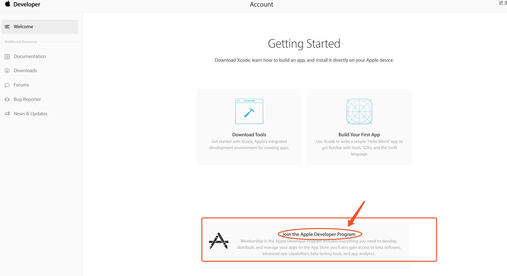
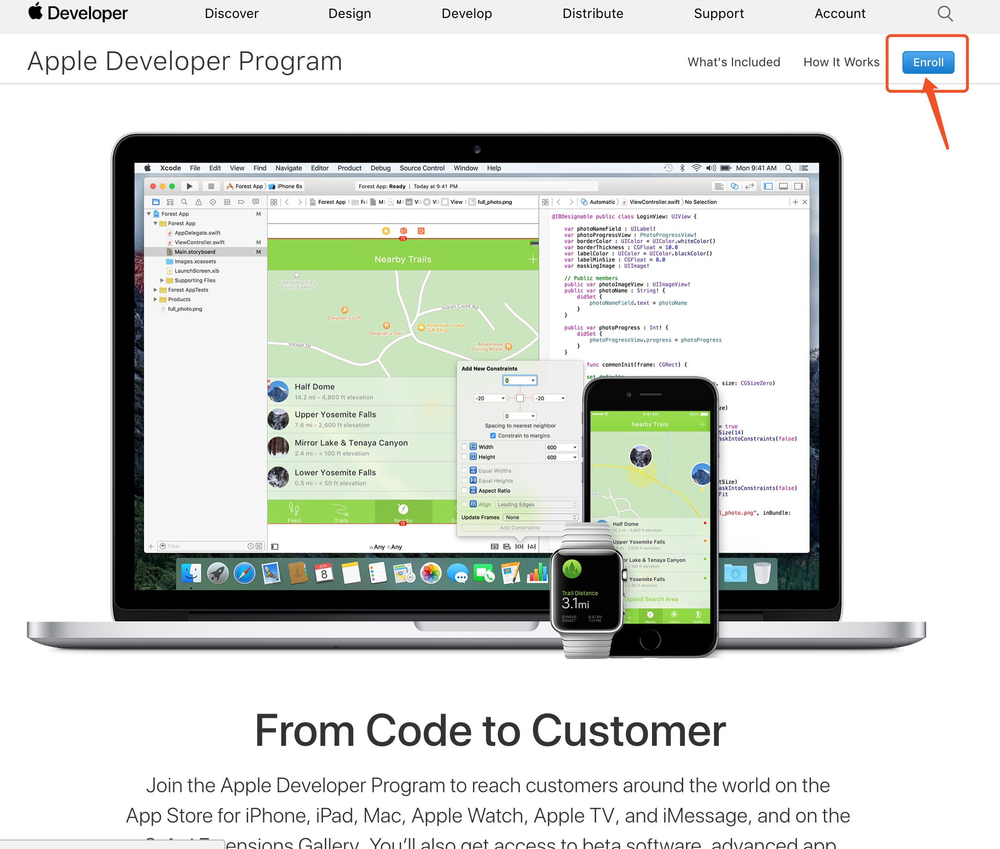
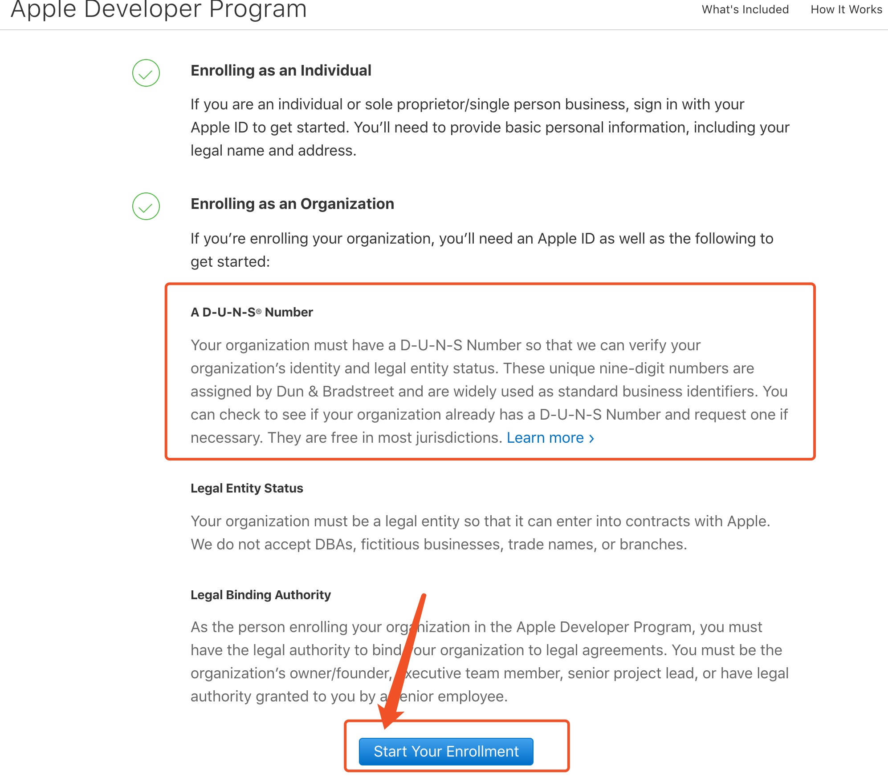
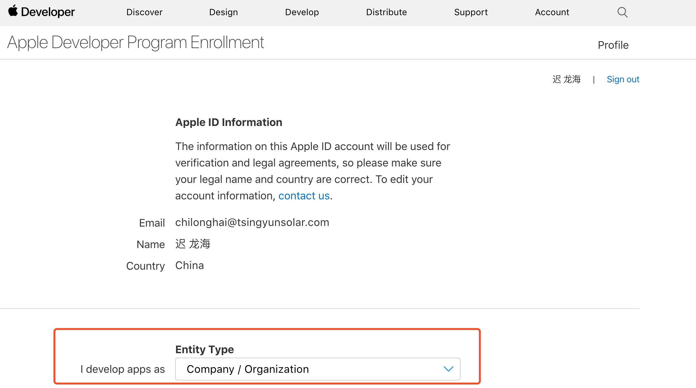
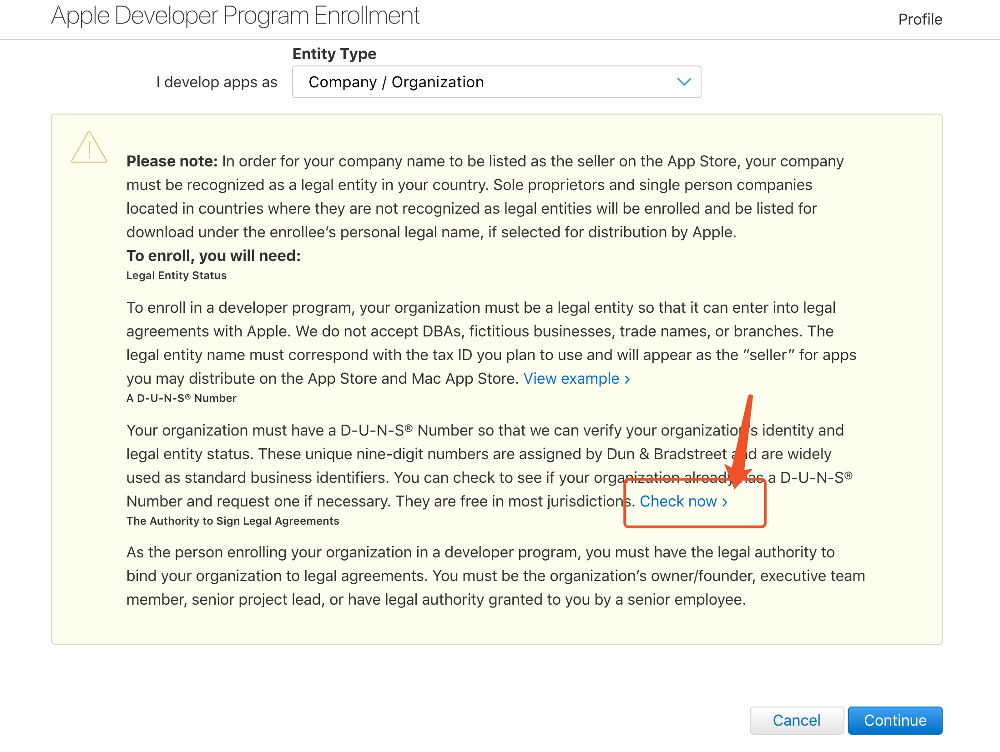
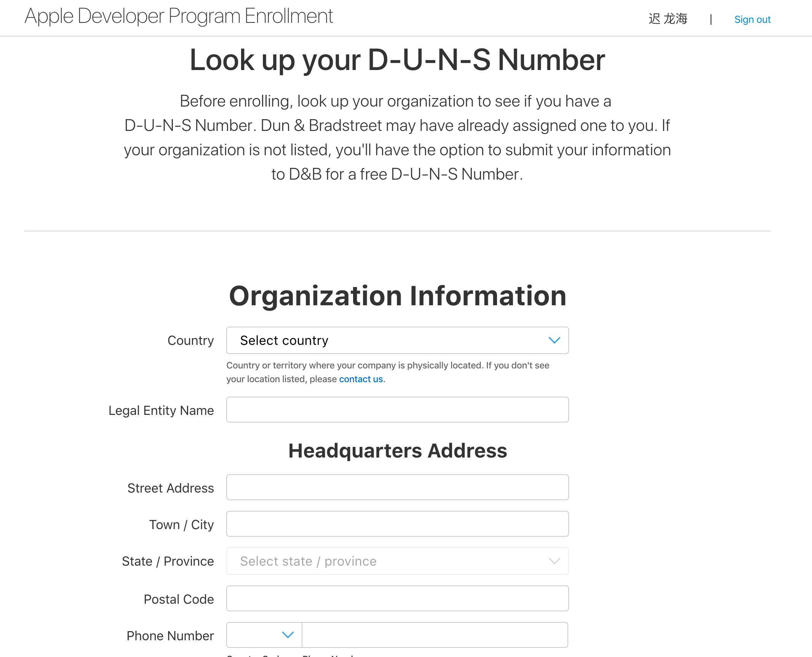
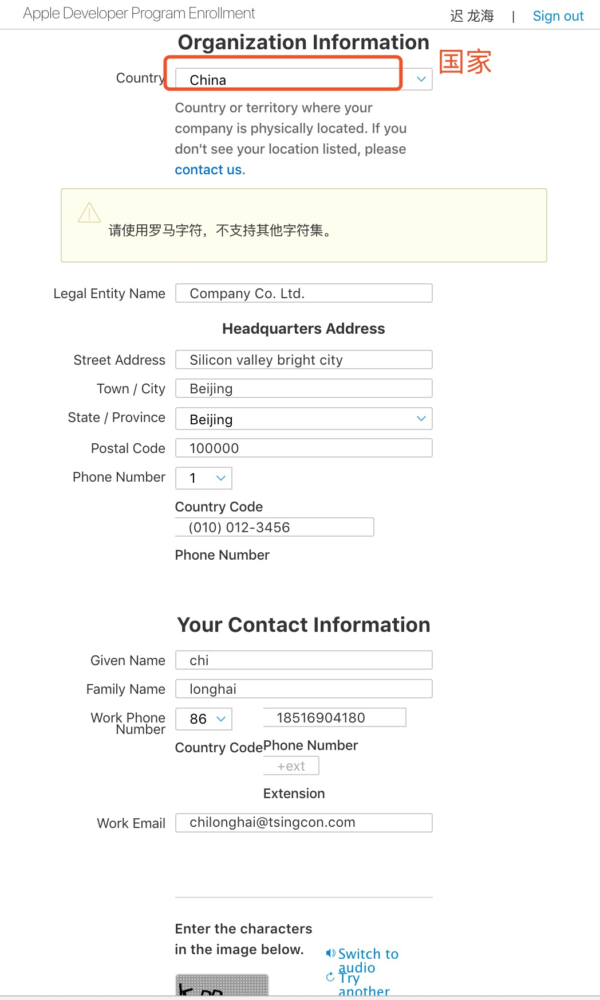
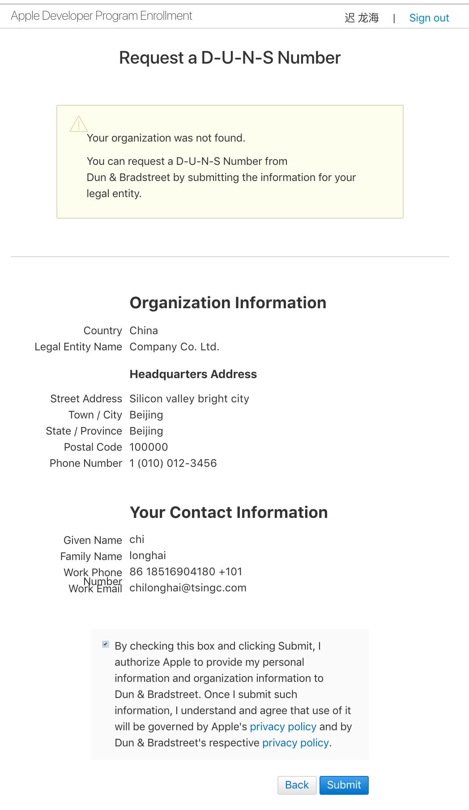
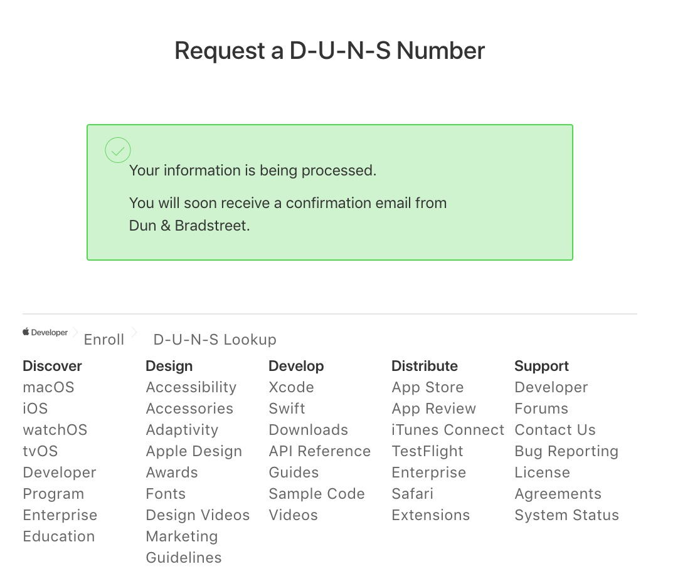

# 299刀的苹果企业开发者账号的购买与管理方法

## 参考文章

[299$的企业开发者账号申请流程](http://www.jianshu.com/p/5975bf3d13be)
[Apple 公司开发者账号&邓白氏码申请记录](http://www.jianshu.com/p/2c3d74c49af9)
重点参考：[2016年苹果开发者账号注册及邓白氏申请流程详解](http://www.jianshu.com/p/983720ac83de)

## 申请该开发者账号的必须步骤

* 公司向邓白氏公司注册并申请有效的DUNS码
* 在苹果开发者中心进行企业开发者申请

### 申请开发者账号

* 使用[该链接](https://appleid.apple.com/account#!&page=create)申请开发者AppleID，建议使用企业域名邮箱申请；

申请完成后如图

* 登录[该官方链接](https://developer.apple.com/program/enroll/dunsLookupForm.action)免费获取邓白氏码，申请表格需要填写英文并提交；

步骤如下：

选择的公司／组织；

此处警告申请开发者证书之前需要申请邓白氏编码，选择D-U-N-S Number下方的“**Check now**”进行邓白氏编码的申请。

在邓白氏申请页面上填写公司相关信息（均使用英文），填写完之后提交。座机需要填写能联系到本人的座机（中国区格式为86-区号+号码+分机号，如86-0755XXXXX-XX）。

表单中的信息必须使用英文填写，此处的图中表单中填写的的信息并非正确信息，实际申请时应该对应实际信息进行填写，之后提交该表单。

苹果公司将发送一个关于DUNS码申请下来的大致时间点以及该提交请求的响应码。

操作到此步，需要暂时告一段落，等待邓白氏编码的申请完成，申请下来会以邮件的形式告知，注意查收邮件。时间大概是一周，如果没下来可以根据响应码咨询。

后续操作待整理。

